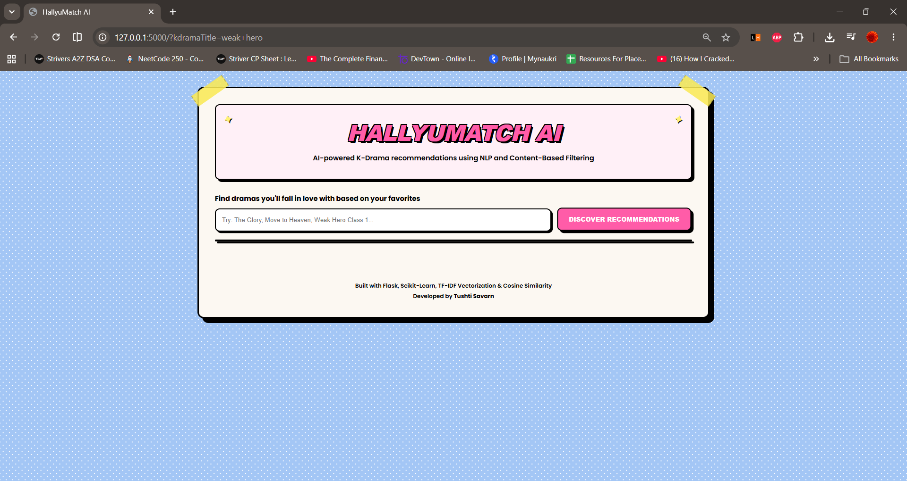
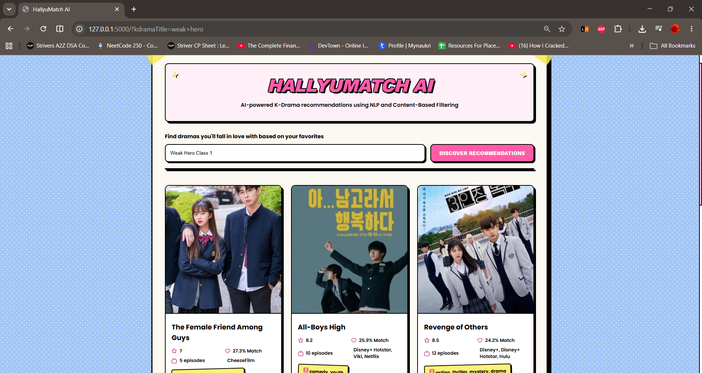
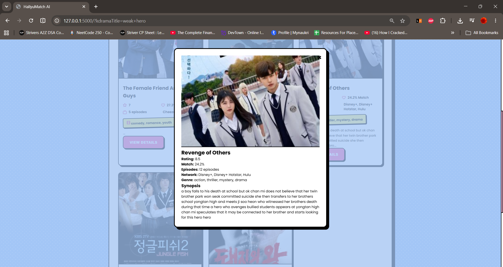

# HallyuMatch AI


A machine learning-powered K-Drama recommendation web application built with Flask and Scikit-learn. HallyuMatch AI helps users discover similar K-Dramas using Natural Language Processing (NLP) and content-based filtering techniques.

---

## Overview

HallyuMatch AI analyzes drama metadata including genres, tags, and plot descriptions to recommend similar dramas based on textual similarity.

The recommendation engine uses:

- TF-IDF Vectorization
- Cosine Similarity
- Content-Based Filtering
- NLP-driven feature extraction

Users can search for a drama title and instantly receive recommendations with relevant details including ratings, episodes, genres, networks, and synopsis information.

---

## Features

- K-Drama title search with autocomplete
- Content-based recommendation engine
- TF-IDF text vectorization
- Cosine similarity matching
- Responsive modern UI
- Drama posters and metadata
- Detailed modal view for recommendations
- Case-insensitive search handling
- Flask REST API backend

---

## Application Preview

### Homepage



### Recommendation Results



### Drama Details Modal



---

## Tech Stack

| Technology | Purpose |
|------------|----------|
| Python | Core Programming Language |
| Flask | Backend Web Framework |
| Pandas | Data Processing |
| Scikit-Learn | Machine Learning |
| TF-IDF Vectorizer | Feature Extraction |
| Cosine Similarity | Recommendation Engine |
| HTML | Structure |
| CSS | Styling |
| JavaScript | Frontend Interactivity |
| Lucide Icons | UI Icons |

---

## Project Structure

```text
kdrama_recommendation/
│
├── app.py
├── kdrama.ipynb
├── kdrama_list.csv
│
├── templates/
│   └── index.html
│
├── static/
│   ├── styles.css
│   └── script.js
│
├── assets/
│   ├── homepage.png
│   ├── recommendations.png
│   └── model-view.png
│
├── requirements.txt
└── README.md
```

---

## Installation

### Clone Repository

```bash
git clone https://github.com/TushtiSavarn/kdrama_recommendation.git

cd kdrama_recommendation
```

### Install Dependencies

```bash
pip install -r requirements.txt
```

Or:

```bash
pip install flask pandas scikit-learn
```

### Run Application

```bash
python app.py
```

Visit:

```text
http://127.0.0.1:5000/
```

---

## Recommendation Pipeline

### 1. Data Cleaning

- Remove duplicate drama entries
- Handle missing values
- Normalize text fields

### 2. Feature Engineering

Combine:

- Genre
- Tags
- Synopsis

into a single feature representation.

### 3. TF-IDF Vectorization

Convert textual information into numerical vectors representing drama content.

### 4. Similarity Computation

Calculate similarity scores using cosine similarity.

### 5. Recommendation Generation

Return the top matching dramas based on similarity scores.

---

## Machine Learning Concepts Used

- Recommendation Systems
- Content-Based Filtering
- Natural Language Processing
- TF-IDF Vectorization
- Cosine Similarity
- Feature Engineering

---

## Learning Outcomes

This project helped strengthen my understanding of:

- Machine Learning fundamentals
- Recommendation systems
- NLP preprocessing techniques
- Flask application development
- Frontend and backend integration
- API development
- User experience design

---

## Limitations

- Recommendations depend on the available dataset.
- Newly released dramas not present in the dataset cannot be recommended.
- Content-based filtering does not consider user preferences or viewing history.

---

## Future Enhancements

- Updated and larger K-Drama dataset
- Hybrid recommendation system
- User profiles and favorites
- Mood-based recommendations
- Real-time drama data integration
- Advanced NLP embeddings
- Personalized recommendation scoring

---

## Author

### Tushti Savarn

MCA Student | AI/ML & Full-Stack Development Enthusiast

GitHub: https://github.com/TushtiSavarn

LinkedIn: https://www.linkedin.com/in/tushti-savarn/

Medium: https://medium.com/@tushtisavran

---

## License

This project is licensed under the MIT License.

See the LICENSE file for details.
